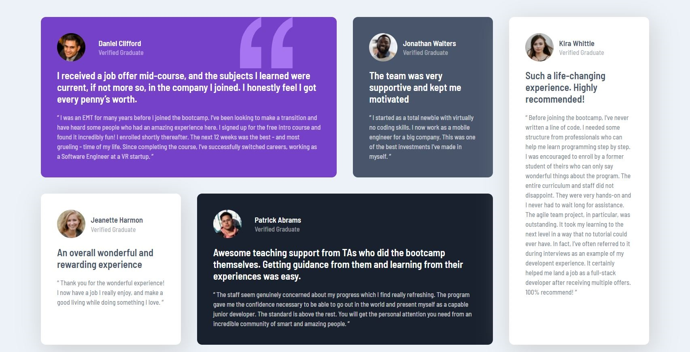

# Frontend Mentor - Testimonials grid section solution

This is a solution to the [Testimonials grid section challenge on Frontend Mentor](https://www.frontendmentor.io/challenges/testimonials-grid-section-Nnw6J7Un7). Frontend Mentor challenges help you improve your coding skills by building realistic projects. 

## Table of contents

- [Overview](#overview)
  - [The challenge](#the-challenge)
  - [Screenshot](#screenshot)
  - [Links](#links)
- [My process](#my-process)
  - [Built with](#built-with)
  - [Continued development](#continued-development)
  - [Useful resources](#useful-resources)
- [Author](#author)

**Note: Delete this note and update the table of contents based on what sections you keep.**

## Overview

### The challenge

The challenge is to build out a testimonials grid section and get it looking as close to the design as possible as notes in the design folder.

Users should be able to:

- View the optimal layout for the site depending on their device's screen size

### Screenshot

### Links

- Solution URL: [Repo](https://github.com/sabrereyn/testimonials-grid-section)
- Live Site URL: [Live Site](https://sabrereyn.github.io/testimonials-grid-section/)

## My process

### Built with

- Semantic HTML5 markup
- CSS custom properties
- CSS Grid
- A bit of Flex
- Desktop-first workflow

### Continued development

The grid is probably always going to be that one concept I won't fully be able to implement without a lot of checking and little changes. I will say that I don't think the grid I've created is 100% perfect, and that's fine. It leaves me work that I can focus and improve on in the future.

### Useful resources

- [CSS Tricks](https://css-tricks.com/snippets/css/a-guide-to-flexbox/) - This site always help with providing helpful information about the grid component (as well as others).

## Author

<!-- - Website - [Add your name here](https://www.your-site.com) -->
- Frontend Mentor - [@sabrereyn](https://www.frontendmentor.io/profile/sabrereyn)
- Twitter - [@Sabre-Reyn](https://twitter.com/Sabre_Reyn)

**Note: Delete this note and add/remove/edit lines above based on what links you'd like to share.**
